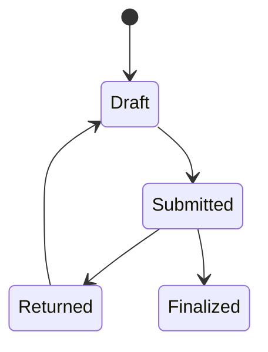
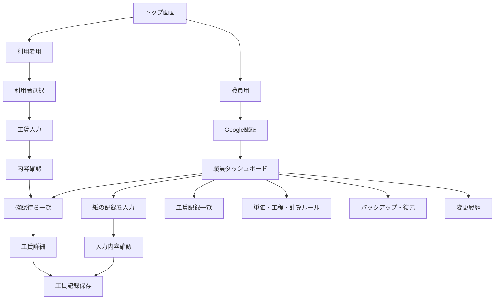

# 工賃記録アプリ 要件定義書（仮）v0.3

> 本書は現時点の仮要件定義書である。業務ルールが確定していない項目は「未確定」、実装方針として仮置きしている項目は「暫定」と表記する。

## 1. 文書情報

| 項目 | 内容 |
|---|---|
| プロダクト | B型事業所向け工賃記録アプリ |
| 対象 | MVP |
| 対象事業所 | 就労継続支援B型事業所 |
| 規模 | 職員・利用者合わせて約30人 |
| 事務職員 | 2〜3名程度 |
| 既存IT環境 | Google Workspace利用 |
| 状態区分 | 確定 / 暫定 / 未確定 / MVP外 |

## 2. プロダクトの目的

就労継続支援B型事業所の工賃計算・記録・確認・履歴管理をデジタル化し、業務負担とミスを減らす。

単なる計算機ではなく、工賃記録を保存し、後から当時の計算内容を再現できる業務アプリとして設計する。漢字を読むことが難しい利用者、文字を視認しにくい利用者、複雑な画面操作に負担を感じる利用者も使用できるよう、アクセシビリティを中核要件とする。

## 3. 現在の業務フロー

```text
利用者 → 紙に作業内容・工賃関連情報を記録
職員   → 紙を確認し、Excelへ転記
```

導入によって直ちに「利用者→アプリ」へ一本化することは前提としない。

## 4. 導入後の業務フロー

| 方式 | 内容 | 状態 |
|---|---|---|
| A | 利用者が紙へ記入 → 職員がアプリへ転記 | 暫定の初期導入方式 |
| B | 紙と利用者直接入力を併用 | 未確定 |
| C | 利用者がアプリへ直接入力 → 職員確認 | 未確定 |

アプリの目的は「利用者が入力するアプリ」に限定せず、「工賃記録業務を管理し、利用者直接入力にも対応できるアプリ」とする。

## 5. SSOT・正式記録の位置付け

本アプリでは工賃について正式記録として扱えるデータを保存する。ただし、紙・Excel・アプリのどれを唯一の正本（SSOT）とするか、記録が異なった場合にどれを正とするかは未確定とする。

段階移行では、次の運用を想定する。

```text
利用者の紙記録 → 職員がアプリへ入力 → 必要に応じて既存帳票・Excel等へ利用
```

## 6. 利用者・職員ロール

### 6-1. 利用者

利用者のアカウント認証は必須としない。本人選択、作業内容入力、工賃確認、職員への送信を想定するが、直接入力をMVP開始時から採用するかは未確定。

### 6-2. 職員

職員は、紙記録の転記、提出内容の確認、工賃確定、過去記録の閲覧、利用者・グレード・工程・単価・計算ルールの管理、バックアップ・復元、変更履歴の確認を行う。工賃確定を誰が行えるかは未確定。

## 7. 基本工賃計算（確定）

```text
工賃 = 時間による工賃 + 工程による工賃
時間による工賃 = 時給 × 作業時間
```

工程ごとの加算を合計して最終工賃とする。

## 8. 計算ルールのカスタマイズ（確定方針）

計算ロジックを画面コンポーネントやソースコードへ直接固定せず、次のように分離する。

```text
入力 → CalculationEngine → CalculationPolicy → 計算結果
```

設定画面から、時間工賃の使用、時間単位、端数処理、工程単位、工程金額、適用開始日等を変更できる方式とする。具体的なルール値は未確定。職員が任意のプログラムや数式を書くルールエンジンは採用しない。

## 9. 工賃ドメインの未確定事項

| 項目 | 状態 |
|---|---|
| 時間入力単位 | 未確定 |
| 時給計算の端数処理・処理タイミング | 未確定 |
| 数量計算（例：10枚100円） | 未確定 |
| 工程数量単位 | 未確定 |
| グレードの意味・決定者 | 未確定 |
| 利用者自身によるグレード選択可否 | 未確定 |
| 単価変更の適用開始方法 | 未確定 |
| 休憩時間の扱い | 未確定 |
| 一日複数回入力・日をまたぐ作業 | 未確定 |
| 検印の意味 | 未確定 |
| 工賃確定者 | 未確定 |
| 確定後の訂正方法 | 未確定 |
| 月次集計 | 未確定 |

業務ルールは開発側で決めず、現行規程・職員への確認結果から決定する。

## 10. 工賃入力元

工賃記録には、誰がどの方法で入力したかを残す。

```text
entry_source
├ staff_transcription   利用者の紙記録を職員が転記
├ participant_direct    利用者がアプリへ直接入力
└ staff_direct          職員が直接作業内容を入力
```

これにより紙運用から直接入力へ段階的に移行できる。

## 11. 工賃記録の状態

暫定的に次の状態を持つ。



| 状態 | 意味 |
|---|---|
| `draft` | 入力途中 |
| `submitted` | 職員確認待ち |
| `returned` | 修正待ち |
| `finalized` | 確定済み |

職員が紙から直接入力した場合に `submitted` を経由する必要があるかは未確定。

## 12. 過去記録の保持・マスタ管理

単価変更によって過去工賃が変わらないよう、工賃確定時に次の値をSnapshotとして保存する。

```text
利用者、作業日、グレード名、当時時給、作業時間
工程名、工程数量、当時工程単価、計算ルールVersion
時間工賃、工程工賃、合計
```

グレード・工程・単価は単純上書きせず、適用期間を持つバージョンとして管理する。工程は物理削除せず、`active = false` 等で使用停止する。

## 13. 利用者向け画面

暫定構成は以下の4画面とする。利用者直接入力の本番運用は未確定だが、将来の移行に対応できるよう設計対象とする。

| ID | 画面 |
|---|---|
| U01 | 利用者選択 |
| U02 | 工賃入力 |
| U03 | 入力内容確認 |
| U04 | 送信完了 |

## 14. 職員向け画面

| ID | 画面 |
|---|---|
| S01 | 職員ログイン |
| S02 | ダッシュボード |
| S03 | 新しい工賃記録入力（紙からの転記） |
| S04 | 確認待ち一覧 |
| S05 | 工賃記録詳細・確認 |
| S06 | 工賃記録一覧 |
| S07 | 利用者管理 |
| S08 | グレード・時給管理 |
| S09 | 工程・単価管理 |
| S10 | 計算ルール管理 |
| S11 | バックアップ・復元 |
| S12 | 変更履歴 |

職員入力画面は、現行の「紙→Excel」を「紙→アプリ」へ置き換える重要画面とする。

## 15. 推奨画面遷移



## 16. アクセシビリティ方針

アクセシビリティを基本仕様とする。

- 白をベースカラー、緑をアクセントカラーとする
- 色だけで状態を表現せず、文字・形・色を併用する
- 本文18〜20px以上、やさしい表示20〜24px程度を暫定基準とする
- 操作ボタンは44〜48px以上を基本とする
- 行間は1.5以上、アイコンだけの操作や省略英語を避ける
- `/h` は「1時間」、`4 h` は「4時間」と表示する
- フォントはBIZ UDPゴシック等を候補とする（利用者確認前のため暫定）
- WCAG 2.2 AAを基本目標とする

## 17. 文字・ルビ・やさしい表示

画面幅によって表示仕様を変更する。

| 画面 | 通常表示 | やさしい表示 |
|---|---|---|
| 広い画面 | 漢字を使用し、読みにくい漢字には原則ルビ | 漢字を原則使わず、平仮名・平易な表現 |
| 狭い画面 | 領域を圧迫するためルビは原則非表示 | 漢字を平仮名へ置換 |

具体的なブレークポイントは未確定。表示用データは自動変換せず、次のように管理する。

```text
label       版準備・仕込み
reading     はんじゅんび・しこみ
easy_label  はんじゅんび・しこみ
```

やさしい表示へ切り替えても操作位置を大きく変えず、利用者がUIを覚え直さずに済むことを重視する。

## 18. 「つかいかた」ビュー

利用者画面に常時「？ つかいかた」を配置する。長文マニュアルではなく、次のような段階表示とする。

```text
① なまえをえらびます
② はたらいたじかんをいれます
③ やったさぎょうの「＋」をおします
④ ないようをかくにんします
```

操作途中でも開け、閉じた後は元の入力状態へ戻れること。

## 19. 認証・認可

### 利用者

Google認証は要求しない方向とする。利用者識別方法は未確定。

### 職員

Google Workspaceを利用するため、Google認証を第一候補とする。

```text
職員ページ → Cloudflare Access → Google Workspace認証
          → 職員として許可されているか確認
          → アプリ側Role確認 → 職員画面
```

「Google認証成功」と「職員権限取得」を分離し、利用者UIと職員UIの分離、Cloudflare Access、職員アカウント制限、サーバー側Role認可を組み合わせる。追加MFAは未確定。Cloudflare AccessのポリシーやMFAの適用は導入時の公式仕様を確認する。

## 20. 技術構成（暫定）

| 領域 | 技術 |
|---|---|
| Frontend | React |
| 言語 | TypeScript |
| Build | Vite |
| Hosting | Cloudflare Workers Static Assets / Pages |
| API | Cloudflare Workers |
| DB | Cloudflare D1 |
| 職員アクセス制御 | Cloudflare Access |
| IdP | Google Workspace |
| バリデーション | Zod |
| Unit Test | Vitest |
| E2E | Playwright |
| A11y Test | axe-core |
| CI/CD | GitHub Actions |
| 将来バックアップ先 | Google Workspace共有ドライブ |

30人程度の規模では、Kubernetes・Redis・マイクロサービス等は採用しない。

## 21. バックアップ（MVP）

職員画面から「バックアップファイルを保存」を実行できる。形式はスプレッドシート形式を基本とし、`.xlsx`を暫定候補とする。

バックアップは閲覧用一覧ではなく復元可能なファイルとし、次のデータを含める。

```text
wage_backup_YYYY-MM-DD.xlsx
├ 工賃記録
├ 作業明細
├ 利用者
├ グレード・時給履歴
├ 工程・単価履歴
├ 計算ルール
├ 変更履歴
└ バックアップ情報
```

バックアップ情報には `schema_version`、`app_version`、`exported_at`、`record_count` 等を含める。

## 22. バックアップ通知・復元

職員ダッシュボードに最後のバックアップ日時と保存を促す通知を表示する。未実施を理由に工賃記録業務を停止させない。通知頻度は未確定で、週1回程度を初期候補とする。

復元時は、ファイル確認、Schema Version確認、データ整合性確認、復元内容表示、職員確認、復元の順に処理し、選択しただけでDBを上書きしてはならない。

## 23. バックアップ受入条件（MVP正式要件）

アプリから出力したバックアップファイルを使用して、空のテスト環境へデータを復元できること。次を確認する。

| 検証対象 | 条件 |
|---|---|
| 利用者 | 件数・内容一致 |
| 工賃記録 | 件数一致 |
| 作業明細 | 件数一致 |
| 工賃合計 | 一致 |
| 当時単価 | 一致 |
| 単価履歴 | 一致 |
| 計算ルールVersion | 一致 |
| 確定状態 | 一致 |
| 過去記録表示 | 元環境と一致 |

「Excelファイルをダウンロードできる」だけではバックアップ機能完成とはみなさない。

## 24. 復旧方針

D1 Time Travelは直近の削除・更新事故からの短期復旧、スプレッドシートバックアップは長期間の保全・環境復元に使用する。保持期間・容量等は導入時点のCloudflare公式仕様を確認する。

```text
D1 Time Travel          → 直近事故から復旧
スプレッドシートバックアップ → 長期保全・環境復元
```

Google Drive / Google Workspace共有ドライブへのScheduled Workerによる自動バックアップはMVP外とする。

## 25. 監査ログ（MVP）

「誰が、いつ、何を、どの値から、どの値へ変更したか」を保持する。対象は、工賃確定・訂正、グレード変更、時給変更、工程追加・停止・単価変更、計算ルール変更、バックアップ出力・復元とする。

## 26. 非機能要件

| 分類 | 要件 |
|---|---|
| 可用性 | 通常の事業所営業時間内で安定稼働 |
| 性能 | 30人規模で操作待ちを感じにくい |
| 金額 | 浮動小数点誤差を工賃へ持ち込まない |
| データ | 過去記録の再現性を維持 |
| セキュリティ | HTTPS必須 |
| 認証・認可 | 職員のみ。サーバー側でもRole確認 |
| 監査 | 重要操作を記録 |
| 復旧 | バックアップから復元可能 |
| A11y | WCAG 2.2 AAを基本目標 |
| 端末 | PC・タブレット・スマートフォン |
| 保守 | IT専門職がいなくても通常操作可能 |

## 27. MVP範囲（仮）

### MVPに含める

- 職員Google認証、Cloudflare Access、サーバー側Role認可
- 職員による紙からの転記
- 工賃計算、内訳、記録、確認、利用者管理
- グレード・時給管理、工程・単価管理
- Calculation Policy、単価Version管理、Snapshot
- 監査ログ
- やさしい表示、PC通常表示ルビ、モバイル向け表示、つかいかたビュー
- PWA、`.xlsx`等へのバックアップ、通知、インポート、完全復元試験
- D1 Time Travelを考慮した復旧設計

### MVPの扱いが異なる機能

| 機能 | 状態 |
|---|---|
| 利用者直接入力画面 | 暫定（画面は設計・実装対象） |
| 利用者直接入力の本番運用 | 未確定 |

## 28. MVP外

- Google Drive自動バックアップ、Google共有ドライブ自動保存
- 複数事業所対応
- 会計システム・給与システム連携
- BI・高度分析
- 自由数式ルールエンジン
- 高度なMFA（必要性未確定）

## 29. 特に重要な未確定事項

| 優先 | 項目 |
|---|---|
| A | 紙を継続するか、利用者直接入力へ移行するか |
| A | 紙・Excel・アプリのどれを正本とするか |
| A | 工賃を誰が正式確定するか |
| A | 工賃計算の時間単位・端数ルール |
| A | 工程数量の計算方法 |
| B | 利用者識別方法、職員代理入力時の確認フロー |
| B | 確定後訂正方法、グレード運用、検印の意味 |
| B | バックアップ頻度、復元権限 |
| C | MFA、月次集計、紙の保存期間 |

## 30. 現段階の設計原則

1. 現行業務をいきなり破壊せず、まず「紙→Excel」のExcel部分をアプリへ置換できるようにする。
2. 工賃ルールをコードへ固定せず、Calculation Policyで変更に対応する。
3. 過去の正式記録を現在の設定変更で変化させず、単価・工程・計算条件をSnapshotとして保存する。
4. アクセシビリティを後付けにせず、通常表示・やさしい表示を同じUI構造上で提供する。
5. バックアップは「保存できた」ではなく「戻せた」を完成条件とする。

## 31. 要件定義上の改善ポイント

最大の曖昧さは、「正式な工賃記録」と「紙・Excelを当面併用する可能性」が同時に存在している点である。今後、「アプリ保存分を正式記録とするが紙も証跡として保管する」のか、「紙が正式記録でアプリはデジタル転記」とするのかを明確にする必要がある。

また、「利用者直接入力」はUIとして開発することと、実際の業務で採用することを分離する。これにより、現場の移行速度に合わせて運用できる。

## 32. 根拠となる資料

- [厚生労働省：指定障害福祉サービス事業者等の指導監査について](https://www.mhlw.go.jp/web/t_doc?dataId=00tb9830&dataType=1&pageNo=14&utm_source=chatgpt.com)
- [厚生労働省令：障害福祉サービス事業の設備及び運営に関する基準](https://www.mhlw.go.jp/web/t_doc?dataId=83aa8470&utm_source=chatgpt.com)
- [W3C：Using the ruby element](https://www.w3.org/WAI/WCAG21/Techniques/html/H62?utm_source=chatgpt.com)
- [W3C：Use Clear Visible Labels](https://www.w3.org/WAI/WCAG2/supplemental/patterns/o4p06-clear-labels/?utm_source=chatgpt.com)
- [Cloudflare One：Common Access policies](https://developers.cloudflare.com/cloudflare-one/access-controls/policies/common-policies/?utm_source=chatgpt.com)
- [Cloudflare One：Enforce MFA](https://developers.cloudflare.com/cloudflare-one/access-controls/policies/mfa-requirements/?utm_source=chatgpt.com)
- [Cloudflare D1：Limits](https://developers.cloudflare.com/d1/platform/limits/?utm_source=chatgpt.com)

